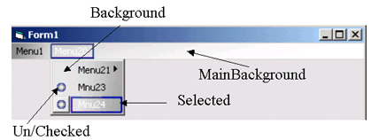



## Owner Drawn Menu for use with images like office

### Description

Customize your menu with images.

Just create a menu with the VB Menu editor. Add some PictureBoxes to your form and assign to the CMenu class.

This class uses the whole region of the main-menu not only the regions of the items. So, if the window width changes, the background image of the main-menu also does.

The screenshot shows where PictureBoxes are applied.

UPDATE:

Now using a better method for subclassing. A MsgBox blocked the WM_DRAWITEM message when running in the IDE and as long as the msgbox was on top, the menubar was grey. This doesn't happen in the new version.
 
### More Info
 

             |
---                |---
**Submitted On**   |2002-12-15 22:28:44
**By**             |[gerald nt](https://github.com/Planet-Source-Code/PSCIndex/blob/master/ByAuthor/gerald-nt.md)
**Level**          |Intermediate
**User Rating**    |5.0 (25 globes from 5 users)
**Compatibility**  |VB 6\.0
**Category**       |[Custom Controls/ Forms/  Menus](https://github.com/Planet-Source-Code/PSCIndex/blob/master/ByCategory/custom-controls-forms-menus__1-4.md)
**World**          |[Visual Basic](https://github.com/Planet-Source-Code/PSCIndex/blob/master/ByWorld/visual-basic.md)
**Archive File**   |[Owner\_Draw15137812152002\.zip](https://github.com/Planet-Source-Code/gerald-nt-owner-drawn-menu-for-use-with-images-like-office__1-41386/archive/master.zip)

